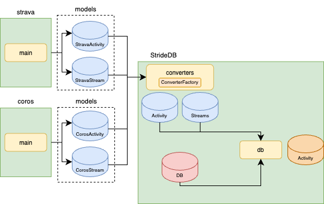

======
Stride
======

A fitness activity data aggregator that unifies data from multiple fitness platforms into a single, queryable database.

*Architecture: Multi-provider fitness data integration with unified storage*
